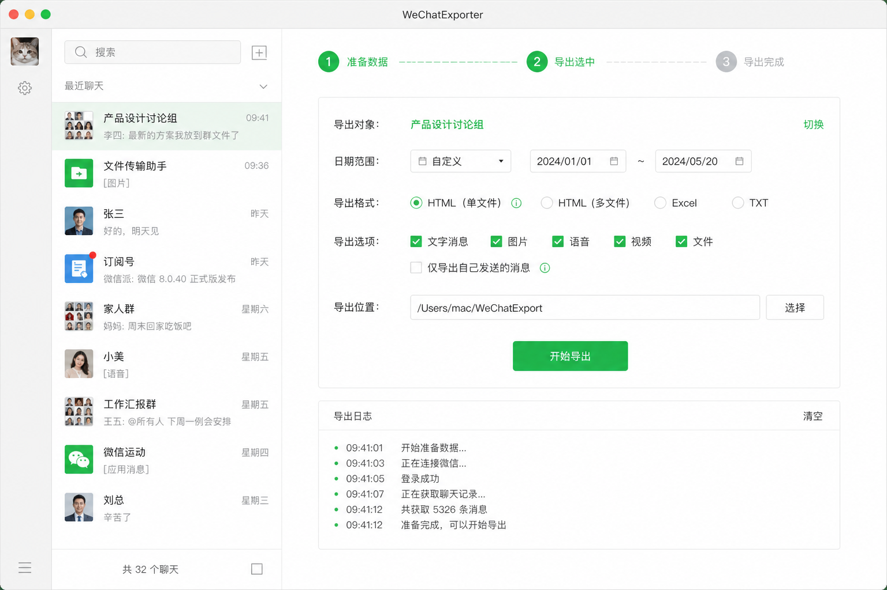

# WeChatExporter

[](https://github.com/93857536-pixel/WeChatExporter/releases/latest)
[](LICENSE)
[](https://github.com/93857536-pixel/WeChatExporter)

原生应用，用于在本地导出**自己的**微信聊天记录。完全离线运行，不上传数据或密钥。

**English README:** [README.en.md](README.en.md)

- **macOS 版**：Swift + SwiftUI，提供 DMG 安装包
- **Windows 版**：.NET 8 WPF，自包含 zip（无需安装 .NET）



## 下载（推荐）

前往 **[GitHub Releases](https://github.com/93857536-pixel/WeChatExporter/releases/latest)** 下载最新版：

| 平台 | 文件 | 说明 |
|------|------|------|
| macOS (Apple Silicon) | `WeChatExporter-macOS-arm64.dmg` | 打开 DMG，拖到「应用程序」即可安装 |
| macOS (备用) | `WeChatExporter-macOS-arm64.zip` | 解压后打开 `.app` |
| Windows (64 位) | `WeChatExporter-Windows-x64.zip` | 解压后运行 `WeChatExporter.exe`，**自包含，无需安装 .NET** |

> 版本更新记录见 [CHANGELOG.md](CHANGELOG.md)

## 功能

- 图形界面：搜索、多选联系人/群聊
- **内置 wx-cli**：安装即用，无需单独安装命令行工具
- **就绪状态提示**：界面顶部显示当前进度（是否已完成「准备数据」）
- **单文件导出**：每个会话生成一个 `.html` 文件，文字与媒体（图片、表情、语音、视频）全部内嵌，浏览器直接打开
- **可选媒体导出**：勾选后将媒体 base64 写入 HTML，并额外导出全部表情包画廊（体积更大，耗时更长）
- 自动检测微信数据目录
- 通过 LLDB / 内存扫描捕获密钥并解密（微信 4.x SQLCipher）
- 导出 TXT / CSV / JSON

## 系统要求

### macOS

| 项目 | 要求 |
|------|------|
| 系统 | macOS 13 (Ventura) 或更高 |
| 芯片 | Apple Silicon (arm64)，暂不支持 Intel Mac |
| 微信 | Mac 版 4.x（已登录并同步过聊天记录） |
| 密钥捕获 | 需关闭 SIP（System Integrity Protection） |

### Windows

| 项目 | 要求 |
|------|------|
| 系统 | Windows 10 / 11（64 位） |
| 运行时 | 无需安装（v2.3.0+ Release 为自包含包） |
| 微信 | PC 版 4.x（已登录并同步过聊天记录） |
| 权限 | 首次「准备数据」建议以管理员身份运行 |

### 兼容说明

| 组件 | macOS | Windows |
|------|-------|---------|
| 内置 CLI | [pandorafuture/wx-cli](https://github.com/pandorafuture/wx-cli) v0.7.2 | [jackwener/wx-cli](https://github.com/jackwener/wx-cli) v0.3.0 |
| 微信版本 | 4.x（4.1.7+ 更稳定） | 4.x（4.1.7+ 更稳定） |

> **隐私说明**：本工具仅在本地运行，不会上传任何聊天数据或密钥。

## 快速开始

### macOS

1. 下载并打开 **`WeChatExporter-macOS-arm64.dmg`**
2. 在弹出的安装窗口中，将 **WeChatExporter** 拖到右侧 **「应用程序」** 文件夹
3. 打开应用（若提示无法验证开发者，请 **右键 → 打开**）
4. 点击 **「准备数据」** → 选择联系人 → **「导出选中」**

### Windows

1. 解压 **`WeChatExporter-Windows-x64.zip`**
2. **右键以管理员身份运行** `WeChatExporter.exe`（首次推荐）
3. 点击 **「准备数据」** → 选择联系人 → **「导出选中」**

默认导出目录：
- macOS：`~/Downloads/微信聊天记录导出/`
- Windows：`%USERPROFILE%\Downloads\微信聊天记录导出\`

## 从源码构建

### macOS

```bash
git clone https://github.com/93857536-pixel/WeChatExporter.git
cd WeChatExporter
./install.sh                  # 构建并安装到桌面与 /Applications
# 或
./build_app.sh                # 仅生成 .app
bash scripts/create_dmg.sh    # 生成 DMG
CREATE_DMG=1 ./install.sh     # 安装同时生成 DMG
```

### Windows

详见 [`windows/README.md`](windows/README.md)。

```powershell
cd windows
./install.ps1    # 安装到桌面
./build.ps1      # 仅构建到 dist/
```

## 项目结构

**macOS**

```
Sources/WeChatExporter/     # SwiftUI 应用
scripts/
├── bundle_wx_cli.sh        # 打包内置 wx-cli
├── create_dmg.sh           # 生成带自定义背景的 DMG
├── generate_dmg_background.py  # DMG 背景图生成
└── prepare_icon.sh         # 生成 AppIcon.icns
assets/AppIcon.png          # 应用图标源文件
assets/dmg-background.png      # DMG 背景 1x（660×400 @72dpi）
assets/dmg-background@2x.png   # DMG 背景 2x（1320×800 @144dpi）
docs/screenshots/           # README 截图
```

**Windows** — 见 [`windows/README.md`](windows/README.md)

## 数据目录

| 用途 | macOS | Windows |
|------|-------|---------|
| 微信加密数据库 | `~/Library/Containers/.../xwechat_files/<账号>/db_storage/` | `%USERPROFILE%\Documents\xwechat_files\<账号>\db_storage\` |
| 应用工作目录 | `~/Library/Application Support/WeChatExporter/<账号>/` | `%USERPROFILE%\.wx-cli\` |
| 导出结果 | `~/Downloads/微信聊天记录导出/` | `%USERPROFILE%\Downloads\微信聊天记录导出\` |

## 常见问题

**提示 SQL 或数据库错误**

点击「准备数据」重新解密。若仍失败，请确认微信已登录且 SIP 已关闭（macOS）。

**密钥捕获失败**

1. 确认微信处于登录状态
2. macOS：确认 SIP 已关闭 `csrutil status`；Windows：以管理员身份运行
3. 重新点击「准备数据」

**应用打不开（macOS）**

```bash
xattr -cr /Applications/WeChatExporter.app
codesign --force --deep --sign - /Applications/WeChatExporter.app
```

**如何反馈问题**

请使用 [Bug Report 模板](https://github.com/93857536-pixel/WeChatExporter/issues/new?template=bug_report.yml) 提交 Issue。

## 参与贡献

见 [CONTRIBUTING.md](CONTRIBUTING.md)。

## 免责声明

- 本工具仅供个人备份**自己的**聊天记录，请勿用于非法用途
- 微信数据库格式可能随版本更新而变化，不保证兼容所有版本
- 使用本工具的风险由使用者自行承担

## License

MIT
